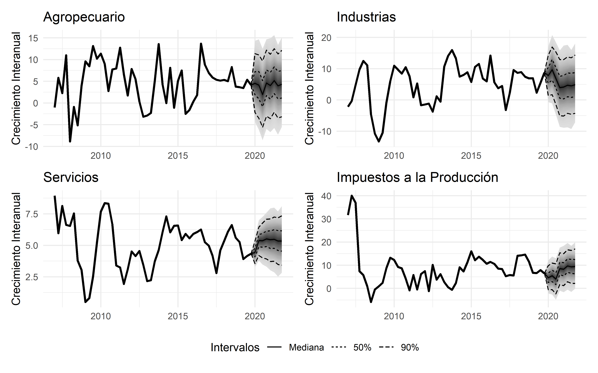

# Estimación de densidades del pronóstico del crecimiento económico en la República Dominicana

El trabajo estima densidades de pronóstico sobre el crecimiento del producto combinando modelos Autoregresivo Integrados de Media Móvil
(ARIMA) para la estimación de la senda central del crecimiento proyectado a 8 periodos, con modelos asimétricos de volatilidad condicional
(GARCH) e incertidumbre histórica alrededor de los pronósticos a diversos horizontes, para la estimación de la volatilidad esperada
alrededor del pronóstico. Con ambos momentos (media y volatilidad) se construyen los percentiles agregados usando una función normal
por parte, cuya incertidumbre procede de la mediana histórica del error de pronostico a diversos horizontes. 

También se realiza una una estiamción ascendente, que utiliza el enfoque de la producción para agregar los errores individuales según el peso de cada sector y obtener la proyección de densidad del producto, permitiendo una descomposición del crecimiento estimado y del error de pronóstico histórico a cada horizonte.

### Evolución del crecimiento del producto real, proyección a un período y bandas de confianza

